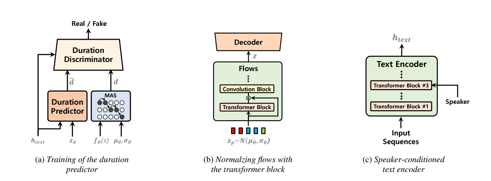

### VITS2: Improving Quality and Efficiency of Single-Stage Text-to-Speech with Adversarial Learning and Architecture Design
### Jungil Kong, Jihoon Park, Beomjeong Kim, Jeongmin Kim, Dohee Kong, Sangjin Kim 
Unofficial implementation of the [VITS2 paper](https://arxiv.org/abs/2307.16430), sequel to [VITS paper](https://arxiv.org/abs/2106.06103). (thanks to the authors for their work!)



Single-stage text-to-speech models have been actively studied recently, and their results have outperformed two-stage pipeline systems. Although the previous single-stage model has made great progress, there is room for improvement in terms of its intermittent unnaturalness, computational efficiency, and strong dependence on phoneme conversion. In this work, we introduce VITS2, a single-stage text-to-speech model that efficiently synthesizes a more natural speech by improving several aspects of the previous work. We propose improved structures and training mechanisms and present that the proposed methods are effective in improving naturalness, similarity of speech characteristics in a multi-speaker model, and efficiency of training and inference. Furthermore, we demonstrate that the strong dependence on phoneme conversion in previous works can be significantly reduced with our method, which allows a fully end-toend single-stage approach.

### Credits
- This repository is a derivative of the [vits2-pytorch](https://github.com/p0p4k/vits2_pytorch/) by p0p4k and the original vits [vits repo](https://github.com/jaywalnut310/vits) . It builds upon their work and incorporates additional features and modifications specific to this project.

### Installing
- To install dependencies:
```bash
sudo apt update
sudo apt install espeak
```
- To create environment:
```bash
conda create -n vits
conda activate vits
pip install -r requirements.txt
```
- To build Build Monotonic Alignment Search
```bash
cd monotonic_align
python setup.py build_ext --inplace
```

### Prepare data

- In this repository, you should have some folders like below:
|__data
|   |__wavs
|       |__audiofile0.wav
|       |__...
|       |__audiofilen.wav
|__filelists
|   |__audio_text_train_filelist.txt
|   |__audio_text_val_filelist.txt

- Run prepare to gen `cleaned` filelist
```bash
python3 preprocess.py --filelists filelists/audio_text_train_filelist.txt filelists/audio_text_val_filelist.txt
```

### Pretrained checkpoints
- [LJSpeech-no-sdp](https://drive.google.com/drive/folders/1U-1EqBMXqmEqK0aUhbCJOquowbvKkLmc?usp=sharing) (refer to config.yaml in this checkppoint folder) | 64k steps | proof that training works!
Would recommend experts to rename the ckpts to *_0.pth and starting the training using transfer learning. (I will add a notebook for this soon to help beginers).


### Training
- To training:
```bash
python train.py -c configs/vits2_ljs_nosdp.json -m ljs_base
```

### Export Onnx
- To export onnx:
```bash
python export_onnx.py --model-path="G_64000.pth" --config-path="config.json" --output="vits2.onnx"
```


### Inference
- To infer with .pth model:
```bash
python inference.py --model="path/to/G_model.pth" --config-path="path/to/config.json" --output-wav-path="output.wav" --text="hello world, how are you?"
```
- To infer with onnx model:
```bash
python infer_onnx.py --model="vits2.onnx" --config-path="config.json" --output-wav-path="output.wav" --text="hello world, how are you?"
```


